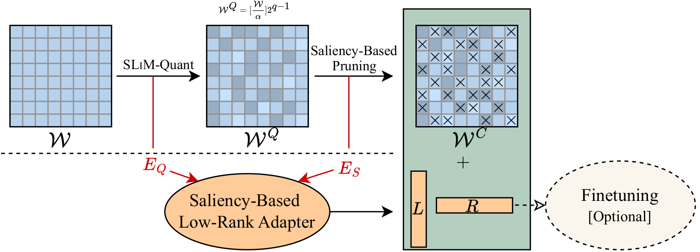
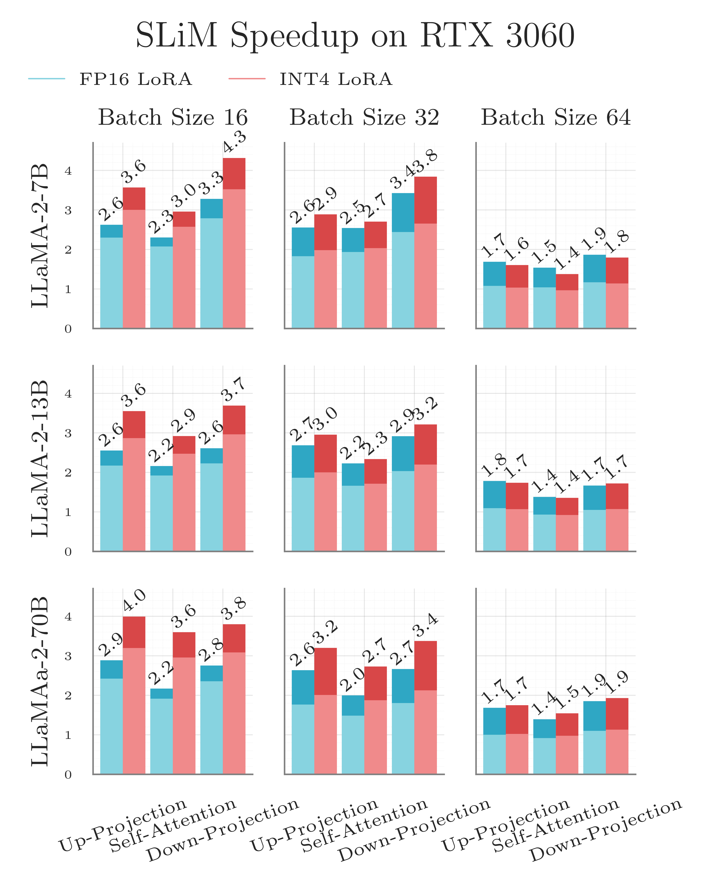

# SLiM: One-shot Quantized Sparse Plus Low-rank Approximation of LLMs

This repository contains the implementation of SLiM (Sparse Low-rank Approximation with Quantization), a novel 
compression technique for large language models (LLMs). SLiM combines a one-shot quantization and sparse low-rank 
approximation to reduce memory usage and improve inference speed without requiring retraining. The approach features 
SLIM-Quant, a symmetric quantization method, and a saliency-based low-rank approximation that leverages sparsity 
patterns like 2:4 for optimized performance on accelerated hardware. With this, SLiM offers state-of-the-art accuracy 
while maintaining efficiency in memory-constrained environments.

**SLiM: One-shot Quantized Sparse Plus Low-rank Approximation of LLMs**

*Mohammad Mozaffari, Amir Yazdanbakhsh, and Maryam Mehri Dehnavi*

Paper: [https://arxiv.org/abs/2410.09615](https://arxiv.org/abs/2410.09615)



## Setup

The list of requirements can be found in the `requirements.txt` file. To install the requirements, run the following command:

```bash 
pip install -r requirements.txt
```

## Quick Start
Our code base supports multiple pruning, quantization, and low-rank approximation techniques. Below, we provide an 
example and a brief description of how to use our code base. For a more automated and detailed example, please refer to
[srcipts/run.sh](scripts/run.sh).

**Model and Tokenizer Instantiation:** Our code base supports models from HuggingFace's transformers library. In this example, we use
the OPT-125M model from [facebook/opt-125m](https://huggingface.co/facebook/opt-125m). Please note that we load the model in CPU to reduce memory overheads 
on GPUs. Our code supports single-GPU compression of very large models, as long as a single transformer block of the 
model fits in the GPU memory.

```python
from transformers import AutoModelForCausalLM, AutoTokenizer
import torch


model_name = "facebook/opt-125m"

model = AutoModelForCausalLM.from_pretrained(
        model_name,
        torch_dtype=torch.bfloat16,
        low_cpu_mem_usage=True,
    )

model.eval()

tokenizer = AutoTokenizer.from_pretrained(
    model_name,
    use_fast=False,
)
```

**Compression:** We provide a function `prune_and_quantize` that takes in a model, tokenizer, and depending on the 
input arguments prunes, quantizes, and add low-rank approximation to the model. Below, we provide an example of how to 
use it for SLiM Low-rank approximation and SLiM-Quant quantization method. More details about the `prune_and_quantize`
function are provided in the **Function Documentation** section.

```python
from slim.prune import prune_and_quantize

quantize_lora_flag = True
lora_tile_size = 256
quantization_bitwidth = 4

prune_and_quantize(
    model=model,
    tokenizer=tokenizer,
    prune_method="wanda",
    sparsity_ratio=0.5,
    quantize_weight=False,
    bitwidth=quantization_bitwidth,
    slim_quant=True,
    lora_rank=0.1,
    sparsity_type="2:4",
    weight_tiled_quantization=quantize_lora_flag,
    quantize_lora=lora_tile_size,
)
```

**Optional Fine-tuning:** After compression, the model can be fine-tuned to compensate for the accuracy loss using the
`fine_tune` function provided in our code base. When using low-rank adapters, the `fine_tune` function will 
automatically freeze the original weights and biases and only fine-tunes the low-rank adapters. Otherwise, the original
weights and biases will be fine-tuned and requantized in the end if needed. Below, we provide an example of how to use
the `fine_tune` function. More details about the `fine_tune` function are provided in the **Function Documentation** section.

```python
from slim.fine_tune import fine_tune

fine_tune(
    model,
    tokenizer,
    max_train_samples=30000,
    optimizer="adafactor",
    global_batch_size=64,
    local_batch_size=8,
)
```

**Adapter Quantization:** In case the `quantize_lora` is set to `True` in the `prune_and_quantize` function, the low-rank
will be prepared for quantization. To finalize the adapter quantization, you can use the `quantize_lora` function.

```python
from slim.lora import quantize_lora

if quantize_lora_flag:
    quantize_lora(
        model,
        bitwidth=quantization_bitwidth,
        lora_tile_size=lora_tile_size,
    )
```

**Input Quantization:** You can emulate input group quantization using the `attach_input_quantization_hooks` function. 
This function attaches hooks to the linear layers of the model to quantize the input activations. We use FP8 quantization with a single parameter when `bitwidth=8` and integer group quantization for other values of `bitwidth`. `input_goup_size=-1` uses per-token quantizatoin.

```python
from slim.quantization.quantization import attach_input_quantization_hooks

attach_input_quantization_hooks(
    model,
    bitwidth=8,
    input_group_size=128, #Only when bitwidth!=8
)
```

**Check Sparsity Ratio:** You can check the sparsity ratio of the model using the `check_sparsity` function.

```python
from slim.utils import check_sparsity

check_sparsity(model)
```

**Evaluate Perplexity:** You can evaluate the perplexity of the model using the `eval_ppl` function.

```python
from slim.eval import eval_ppl

ppl_test = eval_ppl(
    model,
    tokenizer,
    eval_dataset="wikitext2",
    eval_batch_size=8,
)

print(f"WikiText2 Perplexity: {ppl_test:.2f}")
```

**Zero-shot Task Evaluation:** For running the zero-shot task evaluation on the model, and a more automated example of
using the code base, please refer to the [scripts/run.sh](scripts/run.sh) file. You can run it by executing the 
following command.

```bash
bash scripts/run.sh
```

**Note:** If your cluster does not have internet access, you can download the models and datasets using the `scripts/download_data.sh` script.

## Experimental Results

We provide extensive experimental results in the paper. For completeness, we have provided the average accuracy results 
of sparse and quantized models on a range of zero-shot tasks using different pruning and quantization methods in the 
table below. The weights (and possibly the adapter) are quantize to 4 bits using symmetric quantization, and the inputs 
are quantized using 8-bit group quantization. All the group quantization results use a group size of 128.


**Notes:**
- *Best Method* refers to the best quantization method among Group AbsMax, AWQ, OmniQuant, and AffineQuant.
- "OOM" indicates an out-of-memory error.
- **Bold values** indicate the best performance in each section.

### Accuracy of Pruned and Quantized OPT/LLaMA Models over 6 Zero-shot Tasks

| **Pruning/LoRA Method** | **Weight Quantization** | OPT 125M | OPT 350M | OPT 1.3B | OPT 2.7B | OPT 6.7B | OPT 13B | LLaMA-2 7B | LLaMA-2 13B |
|-------------------------|--------------------------|----------|----------|-----------|-----------|-----------|------------|--------------|---------------|
| **Dense**              | -                        | 35.9     | 37.1     | 43.4      | 45.5      | 48.3      | 48.7       | 56.6         | 60.8          |
| **2:4 Sparsity**       |                          |          |          |           |           |           |            |              |               |
| Magnitude              | Group AbsMax             | 32.19    | 31.94    | 33.82     | 33.43     | 34.81     | 34.68      | 44.64        | 44.18         |
| SparseGPT              | Group OPTQ               | 33.70    | 33.38    | 38.75     | 40.15     | 44.32     | 45.64      | 45.49        | 51.05         |
| Wanda                  | Best Method$^*$          | 33.39    | 32.79    | 38.43     | 40.00     | 43.41     | 44.07      | 44.86        | 48.94         |
| JSQ                    | JSQ                      | 32.30    | 31.84    | 35.23     | 32.89     | 38.06     | 37.24      | 44.80        | 50.20         |
| L$^2$QER               | Group AbsMax             | 33.34    | 31.68    | 36.68     | 38.11     | 41.37     | OOM        | 43.77        | OOM           |
| Naive-LoRA             | Quantization$^W$         | 34.28    | 33.38    | 38.36     | 41.21     | 44.91     | 45.25      | 48.45        | 51.94         |
| **SLiM-LoRA**          | Quantization$^W$         | **34.62**| **34.36**| **40.61** | **42.73** | 45.99     | 46.09      | **51.15**    | **54.94**     |
| SLiM-LoRA$^Q$          | Quantization$^W$         | 34.43    | 34.30    | 40.11     | 42.37     | **46.33** | **46.24**  | 51.02        | 53.55         |
| **50% Unstructured**   |                          |          |          |           |           |           |            |              |               |
| Magnitude              | Group AbsMax             | 33.34    | 33.51    | 32.12     | 39.90     | 36.44     | 32.33      | 47.03        | 51.04         |
| SparseGPT              | OPTQ                     | 35.10    | 35.13    | 38.72     | 43.43     | 46.97     | 47.38      | 51.09        | 55.94         |
| Wanda                  | Best Method$^*$          | 35.11    | 33.89    | 41.02     | 42.89     | 46.52     | 46.84      | 53.62        | 56.76         |
| JSQ                    | JSQ                      | 32.14    | 30.34    | 38.86     | 35.48     | 42.75     | 30.73      | 52.25        | 57.00         |
| L$^2$QER               | Group AbsMax             | 34.45    | 34.45    | 38.38     | 41.28     | 45.08     | OOM        | 50.60        | OOM           |
| Naive-LoRA             | Quantization$^W$         | 34.77    | 34.23    | 40.40     | 43.37     | 46.64     | 47.30      | 51.52        | 55.33         |
| **SLiM-LoRA**          | Quantization$^W$         | 35.20    | **35.32**| **41.85** | 43.48     | 47.08     | **47.96**  | **54.26**    | **57.85**     |
| SLiM-LoRA$^Q$          | Quantization$^W$         | **35.35**| 35.13    | 41.74     | **43.63** | **47.16** | 47.86      | 54.18        | 57.33         |

## Function Documentation
Here we provide a brief description of a few of the main functions in our code base. For details about the other 
functions, please refer to their dockstrings.
### **slim.prune.prune_and_quantize:**
- `model`: The model to be pruned and quantized.
- `tokenizer`: The tokenizer of the model.
- `bitwidth`: The bitwidth to be used for quantization.
- `slim_quant`: Whether to use SLiM-Quant for pruning. If set to 'False', AbsMax or OPTQ (GPTQ) will be used for quantization.
- `weight_tiled_quantization`: Whether to use weight tiled (group) quantization. We do not recommend using this option with SLiM-Quant.
- `weight_tile_size`: The size of the weight tiles to be used for weight tiled quantization.
- `prune_method`: The pruning method to be used. We support `wanda`, `sparsegpt`, and `magnitude`. If using `sparsegpt`, the `slim_quant` should be set to `False`.
- `sparsity_ratio`: The sparsity ratio to be used for pruning.
- `sparsity_type`: The sparsity type to be used for pruning. We support `unstructured` and `N:M` sparsity.
- `quantize_weight`: Whether to quantize the weights of the model.
- `nsamples`: The number of samples for calibration.
- `shift_zero_metrics`: Whether to shift the zero metrics in Wanda.
- `lora_rank`: The rank to be used for low-rank approximation (between 0. and 1.). If set to 0., no low-rank approximation will be used.
- `slim_lora`: Whether to use SLiM for low-rank approximation.
- `prune_lora`: Whether to 2:4 prune the left low-rank adapter `L`. For setting this option, `sparsity_type` should be set to `2:4`.
- `quantize_lora`: Whether to quantize the low-rank adapters.
- `lora_tile_size`: The size of the low-rank adapter tiles to be used for low-rank approximation. 
- `separate_lora`: Whether to keep the low-rank adapters separate from the model weights. If set to `False`, the low-rank adapters will be merged with the model weights.
- `seed`: The seed to be used for reproducibility.
- `joint_pq_mixing_factor`: The mixing factor to be used for joint pruning and quantization (JSQ).
- `calibration_dataset`: The dataset to be used for calibration.
- `pad_lora`: Whether to pad the low-rank adapters to `lora_tile_size` when not using LoRA quantizatoin.
- `scale_important_weights`: Whether to scale the important weights in quantization (similar to AWQ).

### **slim.fine_tune.fine_tune:**
- `model`: The model to be fine-tuned.
- `tokenizer`: The tokenizer of the model.
- `dataset_name`: The dataset to be used for fine-tuning.
- `dataset_config_name`: The configuration of the dataset to be used for fine-tuning.
- `validation_split_percentage`: The percentage of the dataset to be used for validation.
- `streaming`: Whether to use streaming for loading the dataset.
- `preprocessing_num_workers`: The number of workers to be used for preprocessing.
- `overwrite_cache`: Whether to overwrite the cache.
- `block_size`: The block size to be used for the dataset.
- `max_train_samples`: The maximum number of samples to be used for training.
- `max_eval_samples`: The maximum number of samples to be used for evaluation.
- `cache_dir`: The directory to be used for caching.
- `optimizer`: The optimizer to be used for fine-tuning. We suggest using `adamw_torch` for as the optimizer. In case low avaiable memory, `adafactor` can be used.
- `global_batch_size`: The global batch size to be used for fine-tuning.
- `local_batch_size`: The local batch size to be used for fine-tuning.

## Speedup Experiments

We support both layer-wise and end-to-end model speedup evaluation. 

### Layer-wise Speedup

For layer-wise
speedup experiments, please refer to `speedup/layerwise_speedup.py`. You can set the 
`quanti_only` flag to `True` to only evaluate the quantization speedup. If set to `False`,
both sparsity and quantization speedup will be evaluated. We use [Sparse Marlin](https://github.com/IST-DASLab/Sparse-Marlin)
integrated in [vLLM](https://github.com/vllm-project/vllm) in our code. The following 
figures show the SLiM's speedup with FP16 and INT4 low-rank adapters on NVIDIA RTX-3060 and
A100 GPUs. The bright part shows the contribution of the quantization to the total speedup.




### End-to-End Model Speedup

For end-to-end model speedup experiments, you can run `scripts/model_speeup.sh`. This script will 
run `speedup/model_speedup.py` file, which supports dense, spase-quantized, and SLiM (with both 
FP16 and INT4 LoRA)
model evaluations. Currently, the models are pruned using magnitude pruning and quantized
using AbsMax. Loading the quantized checkpoints should be a straightforward modification
to the code, and we will support it in the future. We do not report the end-to-end speedup
here, since most of the time, the dense FP16 models (baseline) do not fit in a single
GPU with the batch sizes 16 to 64.

## Acknowledgement
This repository is build upon the [SparseGPT](https://github.com/IST-DASLab/sparsegpt) and the [Wanda](https://github.com/locuslab/wanda) repository.

## Citation
If you use SLiM in your research, please cite our paper:
```angular2html
@article{mozaffari2025slim,
    title        = {{SLiM: One-shot Quantized Sparse Plus Low-rank Approximation of LLMs}},
    author       = {Mozaffari, Mohammad and Yazdanbakhsh, Amir and Mehri Dehnavi, Maryam},
    year         = 2025,
    url          = {https://openreview.net/forum?id=4UfRP8MopP}
}
```
